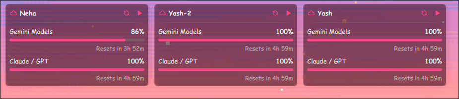

# 🚀 Antigravity Multi-Agent Cluster

> Run multiple Google Antigravity instances simultaneously on a single machine — each with its own Google Account, AI persona, and execution settings — while seamlessly syncing chats, projects, and memory across all of them in real-time.



> 🪟 **Windows user?** Skip directly to ➡️ [Part 2: Windows Adaptation](#part-2-windows-adaptation)

---

## Table of Contents

- [Overview](#overview)
- [How It Works](#how-it-works)
- [Prerequisites](#prerequisites)
- [Directory Structure](#directory-structure)
- [Part 1: Linux (Arch) Setup](#part-1-linux-arch-setup)
  - [Step 1: Mock Home Directories & Symlinks](#step-1-mock-home-directories--symlinks)
  - [Step 2: OAuth Routing (xdg-open Wrapper)](#step-2-oauth-routing-xdg-open-wrapper)
  - [Step 3: Keyring Isolation (DBus Proxy)](#step-3-keyring-isolation-dbus-proxy)
  - [Step 4: Language Server Isolation (Wrapper)](#step-4-language-server-isolation-wrapper)
  - [Step 5: Chat Sync Fix (Migration Reset)](#step-5-chat-sync-fix-migration-reset)
  - [Step 6: Turbo Mode Fix (CDP Injector)](#step-6-turbo-mode-fix-cdp-injector)
  - [Step 7: The Orchestrator (switch.sh)](#step-7-the-orchestrator-switchsh)
- [Part 2: Windows Adaptation](#part-2-windows-adaptation)
- [Part 3: Quota Tracker Desktop Widget](#part-3-quota-tracker-desktop-widget)
- [FAQ](#faq)

---

## Overview

Google Antigravity is designed to run as a **single instance** tied to a **single Google Account**. This project breaks that limitation.

**What this cluster gives you:**
- 🧠 **Multiple AI Personas** — Run 3+ widgets, each logged into a different Google Account (e.g., Personal, Work, Client).
- 🔗 **Shared Memory** — All chats, projects, skills, and brain data sync instantly across every widget via filesystem-level linking.
- 🔒 **Isolated Authentication** — Each widget maintains its own OAuth tokens without logging the others out.
- ⚡ **Automated Turbo Mode** — A background daemon silently auto-approves all permission prompts so the AI runs uninterrupted.
- 📊 **Quota Tracker** — A desktop widget that monitors the rolling 5-hour API limits across all accounts in real-time.

**Tested on:** Arch Linux (Wayland/X11) with Google Chrome and GNOME Keyring.

> 💡 **Pro Tip:** This entire cluster was built *with the help of Antigravity itself.* The AI agent wrote the scripts, debugged the keyring isolation, and reverse-engineered the migration system. If you're setting this up yourself, don't hesitate to ask your own Antigravity agent for help — it makes the process significantly faster and easier.

---

## How It Works

The cluster is built on five key techniques:

| Technique | Problem It Solves |
|---|---|
| **Mock Homes + Symlinks** | Prevents multiple instances from overwriting each other's config, while keeping chats synced. |
| **DBus Proxy** | Prevents multiple instances from overwriting each other's OAuth tokens in the GNOME Keyring. |
| **xdg-open Wrapper** | Routes each widget's OAuth login flow to the correct Chrome profile so the right Google Account is selected. |
| **Language Server Wrapper** | Rewrites the `--app_data_dir` flag so each widget stores its internal state in a unique directory. |
| **CDP Injector** | Connects to the Electron UI via Chrome DevTools Protocol and auto-clicks permission prompts to restore Turbo Mode. |

---

## Prerequisites

- **OS:** Arch Linux (adaptable to other distros)
- **Antigravity:** Installed via AUR (`yay -S antigravity`)
- **Bubblewrap (`bwrap`):** `sudo pacman -S bubblewrap`
- **Python 3** with `websockets`: `pip install websockets`
- **Google Chrome** with separate profiles for each Google Account

---

## Directory Structure

```
~/.config/Antigravity-Profiles/
├── switch.sh                    # 🎯 Main launcher script
├── inject_turbo.py              # 🤖 CDP auto-clicker for Turbo Mode
├── quota_1.json                 # 📊 Live quota data for Account-1
├── quota_2.json                 # 📊 Live quota data for Account-2
├── quota_3.json                 # 📊 Live quota data for Account-3
│
├── bin/
│   ├── dbus_proxy.py            # 🔒 Keyring isolation proxy
│   ├── xdg-open                 # 🌐 OAuth routing wrapper
│   └── language_server_wrapper  # ⚙️  App data dir rewriter
│
├── Account-1/                   # Widget 1 (e.g., "Yash")
│   ├── HOME/                    # Mock $HOME for this widget
│   │   └── .gemini/
│   │       ├── antigravity-Account-1/
│   │       │   ├── conversations -> ~/.gemini/antigravity/conversations  (SYMLINK)
│   │       │   ├── brain         -> ~/.gemini/antigravity/brain          (SYMLINK)
│   │       │   ├── skills        -> ~/.gemini/antigravity/skills         (SYMLINK)
│   │       │   └── antigravity_state.pbtxt  (ISOLATED - unique per widget)
│   │       └── config/
│   │           ├── projects     -> ~/.gemini/config/projects             (SYMLINK)
│   │           ├── plugins      -> ~/.gemini/config/plugins              (SYMLINK)
│   │           └── config.json   (ISOLATED - unique per widget)
│   └── logs/
│       └── language_server.log
│
├── Account-2/                   # Widget 2 (e.g., "Yash-2")
│   └── ...                      # Same structure as Account-1
│
└── Account-3/                   # Widget 3 (e.g., "Neha")
    └── ...                      # Same structure as Account-1
```

**Key Insight:** The `conversations`, `brain`, `skills`, and `projects` directories are **symlinked** to the same real location. This is what makes chats appear instantly across all widgets. Everything else is **isolated** so widgets don't interfere with each other.

---

## Part 1: Linux (Arch) Setup

### Step 1: Mock Home Directories & Symlinks

Each widget gets its own "Mock Home" directory. We selectively symlink the shared data folders, but keep configuration files isolated.

**Create the structure for a new profile:**
```bash
PROFILE="Account-1"
REAL_HOME="$HOME"
MOCK_HOME="$HOME/.config/Antigravity-Profiles/$PROFILE/HOME"

# Create the base directories
mkdir -p "$MOCK_HOME/.gemini/antigravity-$PROFILE"
mkdir -p "$MOCK_HOME/.gemini/config"

# Symlink SHARED data (chats, memory, skills)
for dir in brain mcp skills conversations installation_id; do
    if [ ! -e "$MOCK_HOME/.gemini/antigravity-$PROFILE/$dir" ] && [ -e "$REAL_HOME/.gemini/antigravity/$dir" ]; then
        ln -s "$REAL_HOME/.gemini/antigravity/$dir" "$MOCK_HOME/.gemini/antigravity-$PROFILE/$dir"
    fi
done

# Symlink SHARED config (projects, plugins, sidecars)
for p in "plugins" "projects" "sidecars"; do
    rm -rf "$MOCK_HOME/.gemini/config/$p"
    ln -sfn "$REAL_HOME/.gemini/config/$p" "$MOCK_HOME/.gemini/config/$p"
done

# COPY (not symlink!) config.json so each widget has its own persona
if [ ! -f "$MOCK_HOME/.gemini/config/config.json" ] && [ -f "$REAL_HOME/.gemini/config/config.json" ]; then
    cp "$REAL_HOME/.gemini/config/config.json" "$MOCK_HOME/.gemini/config/config.json"
fi
```

> ⚠️ **Important:** Never symlink `config.json` or `antigravity_state.pbtxt`. These must remain isolated so each widget keeps its own persona, model selection, and onboarding state.

---

### Step 2: OAuth Routing (xdg-open Wrapper)

When Antigravity needs to authenticate, it calls `xdg-open` to open a browser. By default, this opens whichever Chrome profile is currently active — which means the wrong Google Account might get selected.

**The Fix:** We replace `xdg-open` inside the `bwrap` sandbox with a custom script that routes each widget to the correct Chrome profile.

**`bin/xdg-open`:**
```bash
#!/bin/bash
URL="$1"

# Force the Google account picker if not already present
if [[ "$URL" == *"accounts.google.com/o/oauth2/auth"* ]]; then
    if [[ "$URL" != *"prompt="* ]]; then
        URL="${URL}&prompt=select_account"
    fi
fi

# Map each Antigravity widget to a specific Chrome profile
CHROME_PROFILE="Default"
if [ "$ANTIGRAVITY_PROFILE" = "Account-1" ]; then
    CHROME_PROFILE="Default"           # your-email-1@gmail.com
elif [ "$ANTIGRAVITY_PROFILE" = "Account-2" ]; then
    CHROME_PROFILE="Profile 7"        # your-email-2@gmail.com
elif [ "$ANTIGRAVITY_PROFILE" = "Account-3" ]; then
    CHROME_PROFILE="Profile 1"        # your-email-3@gmail.com
fi

# Restore the real HOME so Chrome can find its profiles
export HOME="$REAL_HOME"
export DBUS_SESSION_BUS_ADDRESS="unix:path=/run/user/1000/bus"

exec google-chrome --profile-directory="$CHROME_PROFILE" "$URL"
```

> 💡 **Tip:** To find your Chrome profile directory names, go to `chrome://version` in each Chrome profile and look at the "Profile Path".

---

### Step 3: Keyring Isolation (DBus Proxy)

Antigravity stores its OAuth refresh tokens in the **GNOME Keyring** using `libsecret` under a hardcoded schema name `"antigravity"`. If two widgets write to the same keyring entry, they overwrite each other's tokens and log each other out.

**The Fix:** A Python script that acts as a transparent DBus proxy. It intercepts all messages between the widget and the GNOME Keyring, replacing the string `"antigravity"` with `"antigravit1"`, `"antigravit2"`, etc. Because both strings are exactly 11 bytes, the binary DBus message structure remains valid.

**`bin/dbus_proxy.py`:**
```python
import socket, select, sys, os, threading

def proxy(src, dst, profile_id):
    original_str = b"antigravity"
    replace_str  = f"antigravit{profile_id}".encode()  # exactly 11 bytes
    try:
        while True:
            r, _, _ = select.select([src, dst], [], [])
            for s in r:
                data = s.recv(4096)
                if not data:
                    return
                if s is src:  # Client → Server: rewrite schema name
                    data = data.replace(original_str, replace_str)
                    dst.sendall(data)
                else:         # Server → Client: rewrite back
                    data = data.replace(replace_str, original_str)
                    src.sendall(data)
    except:
        pass
    finally:
        src.close(); dst.close()

def main():
    listen_path = sys.argv[1]         # e.g., /tmp/antigravity-dbus-proxy-1.sock
    profile_id  = sys.argv[2][:1]     # e.g., "1"

    real_dbus = os.environ.get("REAL_DBUS_SESSION",
                f"unix:path={os.environ.get('XDG_RUNTIME_DIR', '/run/user/1000')}/bus")
    real_path = real_dbus.split("unix:path=")[1].split(",")[0]

    if os.path.exists(listen_path):
        os.unlink(listen_path)

    server = socket.socket(socket.AF_UNIX, socket.SOCK_STREAM)
    server.bind(listen_path)
    server.listen(5)

    while True:
        client, _ = server.accept()
        target = socket.socket(socket.AF_UNIX, socket.SOCK_STREAM)
        target.connect(real_path)
        threading.Thread(target=proxy, args=(client, target, profile_id), daemon=True).start()

if __name__ == "__main__":
    main()
```

**Usage:** The proxy is launched automatically by `switch.sh` before the widget starts:
```bash
PROXY_SOCKET="/tmp/antigravity-dbus-proxy-1.sock"
python3 bin/dbus_proxy.py "$PROXY_SOCKET" "1" &
export DBUS_SESSION_BUS_ADDRESS="unix:path=$PROXY_SOCKET"
```

---

### Step 4: Language Server Isolation (Wrapper)

Antigravity's Electron shell spawns a backend binary called `language_server`. This binary accepts an `--app_data_dir` flag that controls where it stores internal state (like `antigravity_state.pbtxt`). By default, all instances would use the same directory.

**The Fix:** We use `bwrap` to replace the real `language_server` binary with a wrapper script that appends the profile name to the `--app_data_dir` flag.

**`bin/language_server_wrapper`:**
```bash
#!/bin/bash
new_args=()
skip_next=false

export HOME="$REAL_HOME/.config/Antigravity-Profiles/$ANTIGRAVITY_PROFILE/HOME"

for ((i=1; i<=$#; i++)); do
    arg="${!i}"
    if [ "$arg" = "--app_data_dir" ]; then
        new_args+=("$arg")
        next_idx=$((i+1))
        if [ $next_idx -le $# ]; then
            next_arg="${!next_idx}"
            new_args+=("${next_arg}-$ANTIGRAVITY_PROFILE")  # e.g., "antigravity-Account-1"
            skip_next=true
        fi
    elif [ "$skip_next" = true ]; then
        skip_next=false
    else
        new_args+=("$arg")
    fi
done

exec /tmp/language_server.real "${new_args[@]}"
```

---

### Step 5: Chat Sync Fix (Migration Reset)

Antigravity has an internal migration system (`projects_migration.go`) that maps conversation files to project UUIDs. Once this migration completes, the state file records `MIGRATION_STATUS_COMPLETED` and never re-runs it.

**The Problem:** Because our widgets use separate `--app_data_dir` directories, newly created chats from Widget A won't appear in Widget B unless the migration re-runs.

**The Fix:** Before every launch, we reset the migration flag in `antigravity_state.pbtxt` back to `UNSPECIFIED`, forcing the language server to re-discover and re-map all conversations.

```bash
STATE_FILE="$MOCK_HOME/.gemini/antigravity-$PROFILE/antigravity_state.pbtxt"
if [ -f "$STATE_FILE" ]; then
    sed -i 's/migrate_convos_into_projects: MIGRATION_STATUS_COMPLETED/migrate_convos_into_projects: MIGRATION_STATUS_UNSPECIFIED/' "$STATE_FILE"
    sed -i 's/migrate_retroactive_projects: RETROACTIVE_MIGRATION_STATUS_COMPLETED_UNNECESSARY/migrate_retroactive_projects: RETROACTIVE_MIGRATION_STATUS_UNSPECIFIED/' "$STATE_FILE"
fi
```

> ⚠️ **Side Effect:** Re-running the migration also resets user preferences (like Turbo Mode). That's why we need the CDP Injector (next step).

---

### Step 6: Turbo Mode Fix (CDP Injector)

When migration resets the UI state, your "Turbo Mode" (auto-execution) settings get wiped. The AI will start asking for permission on every single action — which is extremely annoying.

**The Fix:** We built a Chrome DevTools Protocol (CDP) injector. It connects to the Electron UI via WebSocket and injects a `MutationObserver` into the DOM that silently auto-clicks "Always allow" on any permission prompt.

**`inject_turbo.py`:**
```python
import asyncio, websockets, json, sys

async def send_and_wait(ws, msg_id, method, params=None, session_id=None):
    req = {"id": msg_id, "method": method}
    if params: req["params"] = params
    if session_id: req["sessionId"] = session_id
    await ws.send(json.dumps(req))
    while True:
        resp = await ws.recv()
        data = json.loads(resp)
        if data.get("id") == msg_id:
            return data

async def inject_turbo(ws_url):
    try:
        async with websockets.connect(ws_url) as ws:
            # 1. Find the main page target
            resp = await send_and_wait(ws, 1, "Target.getTargets")
            target_id = next(t["targetId"] for t in resp["result"]["targetInfos"] if t["type"] == "page")

            # 2. Attach to it
            resp = await send_and_wait(ws, 2, "Target.attachToTarget",
                                       {"targetId": target_id, "flatten": True})
            session_id = resp["result"]["sessionId"]

            # 3. Inject the MutationObserver auto-clicker
            script = """
            (function() {
                if (window.__turboInjected) return;
                window.__turboInjected = true;
                const observer = new MutationObserver(() => {
                    const btn = Array.from(document.querySelectorAll('button')).find(b =>
                        b.textContent.includes('Always allow') ||
                        b.textContent.includes('Allow')
                    );
                    if (btn && btn.offsetParent !== null) {
                        btn.click();
                        console.log('Turbo Mode: Auto-clicked Allow');
                    }
                });
                observer.observe(document.body, { childList: true, subtree: true });
                console.log('Turbo Mode injector activated');
            })();
            """
            await send_and_wait(ws, 3, "Runtime.evaluate",
                                {"expression": script}, session_id=session_id)
    except Exception as e:
        print("Error:", e)

if __name__ == "__main__":
    if len(sys.argv) > 1:
        asyncio.run(inject_turbo(sys.argv[1]))
```

**How it's triggered:** The `switch.sh` script runs a background daemon that tails the language server log. When the server logs its WebSocket URL, the daemon catches it and runs the injector:
```bash
(
    tail -F "$LOG_FILE" 2>/dev/null | while read line; do
        if echo "$line" | grep -q "Successfully discovered Electron WS URL:"; then
            ws_url=$(echo "$line" | grep -o "ws://[^ ]*")
            python3 inject_turbo.py "$ws_url"
        fi
    done
) &
```

Additionally, we also restore Turbo Mode at the project-settings level by patching all project JSON files after migration completes:
```python
import json, glob
for f in glob.glob("~/.gemini/config/projects/*.json"):
    with open(f, "r") as file: data = json.load(file)
    data.setdefault("settings", {})
    data["settings"]["autoExecutionPolicy"] = "CASCADE_COMMANDS_AUTO_EXECUTION_EAGER"
    data["settings"]["fileAccessPolicy"] = "AGENT_SETTING_POLICY_ALLOW"
    with open(f, "w") as file: json.dump(data, file, indent=2)
```

---

### Step 7: The Orchestrator (`switch.sh`)

This is the master script that ties everything together. Instead of launching Antigravity directly, each widget's shortcut calls this script with a profile name.

**Usage:**
```bash
./switch.sh Account-1   # Launches widget "Yash"
./switch.sh Account-2   # Launches widget "Yash-2"
./switch.sh Account-3   # Launches widget "Neha"
```

**What it does on every launch:**
1. ✅ Creates/verifies the Mock Home symlink structure
2. ✅ Starts the DBus Proxy for keyring isolation
3. ✅ Resets migration flags for chat sync
4. ✅ Starts the CDP Turbo Injector daemon
5. ✅ Launches Antigravity via `bwrap` with the custom Mock Home, xdg-open wrapper, and language server wrapper
6. ✅ Waits for migration to complete, then patches all project settings to restore Turbo Mode

---

## Part 2: Windows Adaptation

Similarly, this can be done on **Windows 10/11**. The architecture uses the same core logic, but adapted to native Windows tools.

| Linux Tool | Windows Equivalent |
|---|---|
| Symlinks (`ln -s`) | Junction Points (`mklink /J`) |
| `bwrap` (Bubblewrap) | Not needed — use `--user-data-dir` flag directly |
| DBus Proxy (`dbus_proxy.py`) | Not needed — use `--password-store=basic` flag |
| `xdg-open` wrapper | Not needed — Windows handles OAuth via default browser |
| `switch.sh` (Bash) | `switch.ps1` (PowerShell) |
| `tail -F` log monitoring | `Get-Content -Wait` in PowerShell |

### Windows Quick Start

**1. Create Junctions:**
```powershell
$Real = "$env:USERPROFILE\.gemini"
$Mock = "$env:USERPROFILE\.gemini-Profiles\Account-1"

New-Item -ItemType Junction -Path "$Mock\antigravity\conversations" -Target "$Real\antigravity\conversations"
New-Item -ItemType Junction -Path "$Mock\antigravity\brain"          -Target "$Real\antigravity\brain"
New-Item -ItemType Junction -Path "$Mock\antigravity\skills"         -Target "$Real\antigravity\skills"
New-Item -ItemType Junction -Path "$Mock\config\projects"            -Target "$Real\config\projects"
```

**2. Launch with isolation:**
```powershell
Start-Process "antigravity.exe" -ArgumentList `
    "--user-data-dir=`"$env:USERPROFILE\.gemini-Profiles\Account-1`"", `
    "--password-store=basic"
```

**3. CDP Injector (same Python script):**
```powershell
Start-Job -ScriptBlock {
    Get-Content "$env:USERPROFILE\.gemini-Profiles\Account-1\logs\language_server.log" -Wait | ForEach-Object {
        if ($_ -match "Successfully discovered Electron WS URL: (ws://.*)") {
            python inject_turbo.py $matches[1]
        }
    }
}
```

> 💡 **Windows is simpler** because the `--password-store=basic` flag eliminates the need for a keyring proxy, and Windows doesn't require `bwrap` for HOME directory isolation.

---

## Part 3: Quota Tracker Desktop Widget

Running multiple AI agents simultaneously means you can quickly burn through your API limits. Antigravity enforces a **rolling 5-hour quota** per model per account. To monitor this, we built a desktop widget that aggregates the quota data across all profiles.

### How It Works

Antigravity silently writes a `quota_N.json` file for each account. These files contain real-time data about every available model:

```json
{
  "timestamp": "2026-07-12T15:27:59.654Z",
  "models": [
    {
      "label": "Claude Opus 4.6 (Thinking)",
      "remainingPercentage": 0.86,
      "isExhausted": false,
      "resetTime": "2026-07-12T20:27:59Z",
      "timeUntilResetMs": 17999351
    },
    {
      "label": "Gemini 3.1 Pro (High)",
      "remainingPercentage": 1.0,
      "isExhausted": false,
      "resetTime": "2026-07-12T20:27:59Z",
      "timeUntilResetMs": 17999351
    }
  ]
}
```

### The Widget

The desktop widget reads these JSON files and renders a clean dashboard showing:
- **Account Name** (Yash, Yash-2, Neha)
- **Gemini Models** — Aggregated remaining percentage across all Gemini variants
- **Claude / GPT** — Aggregated remaining percentage across Claude and GPT models
- **Reset Timer** — Countdown until the 5-hour rolling window resets


> 📝 **Note:** The 5-hour rolling limit is cached locally in these JSON files. Your **weekly limit** is managed by the cloud servers and cannot be easily scraped by local scripts.

---

## FAQ

**Q: Will updating Antigravity break this setup?**
A: No. Updates only replace files in `/opt/Antigravity/`. All of our scripts and profiles live in `~/.config/Antigravity-Profiles/`, which the package manager never touches.

**Q: Does this increase network traffic or token usage?**
A: No. All scripts communicate over `127.0.0.1` (localhost). Zero internet bandwidth is consumed by the cluster infrastructure itself.

**Q: Can chats from Widget A appear in Widget B?**
A: Yes! Because the `conversations` directory is symlinked, all chats are shared. However, they may appear under "Basic Conversations" in Widget B if the associated project/workspace isn't open there.

**Q: What happens if I plug in both chargers at the same time?**
A: Don't. (See the hardware section of our internal notes. 😄)

---

## 🔮 What's Next

> **A similar multi-instance cluster is currently being built for [Claude Code](https://claude.ai) (Anthropic's agentic coding tool).** If you're interested in running multiple Claude Code sessions with shared memory and isolated authentication, stay tuned!
>
> ⭐ **Star this repo** and **[follow me on GitHub](https://github.com/ypatil2006-coder)** to get notified when the Claude Code cluster drops.

---

## License

MIT — Use it, fork it, improve it. Contributions welcome.
